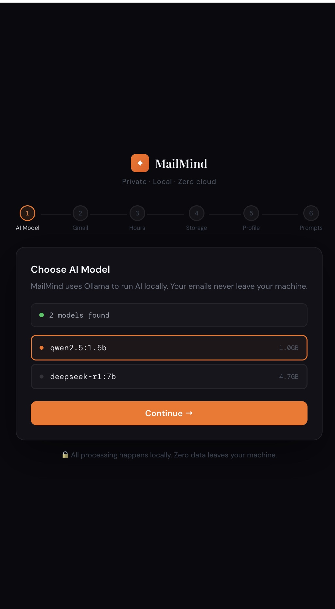
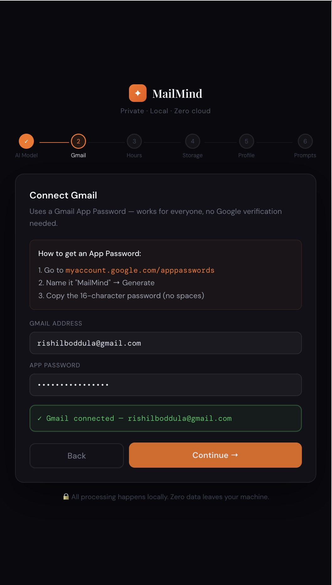
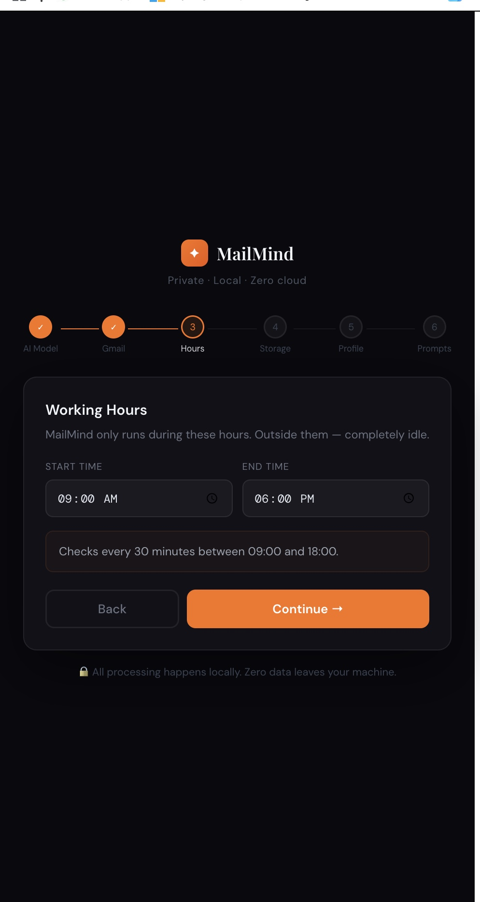
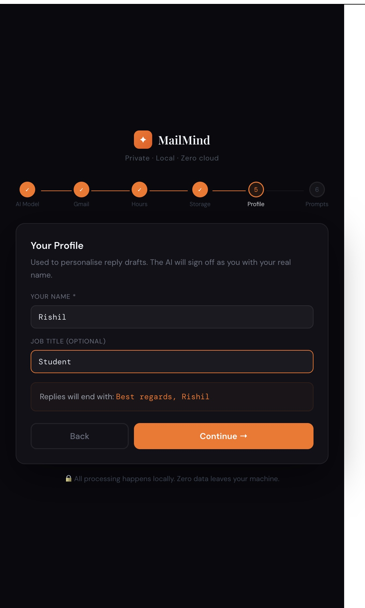
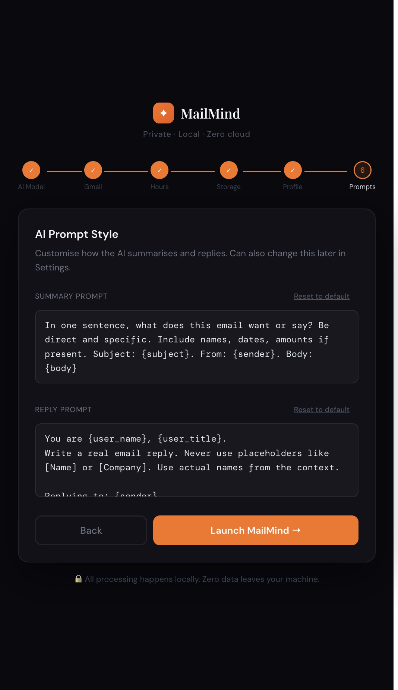
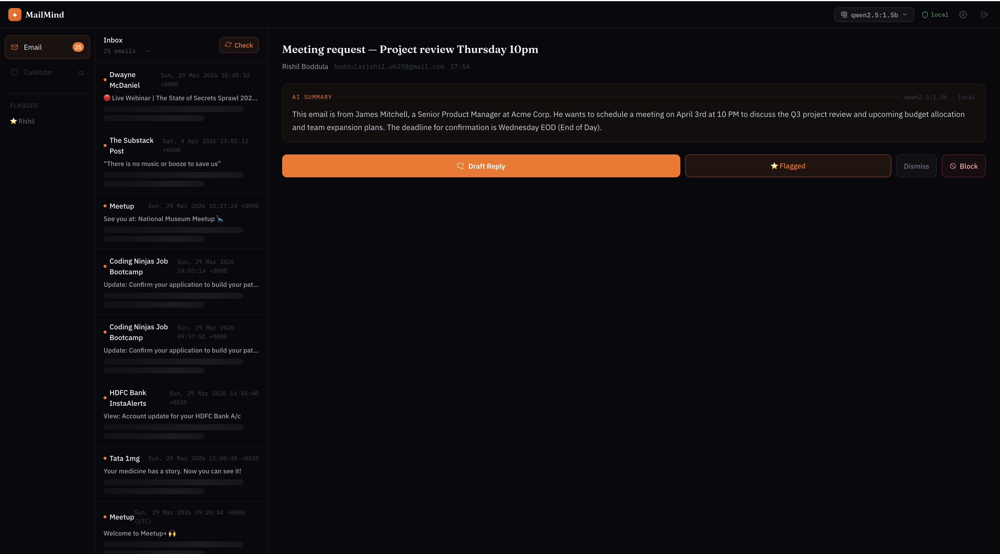
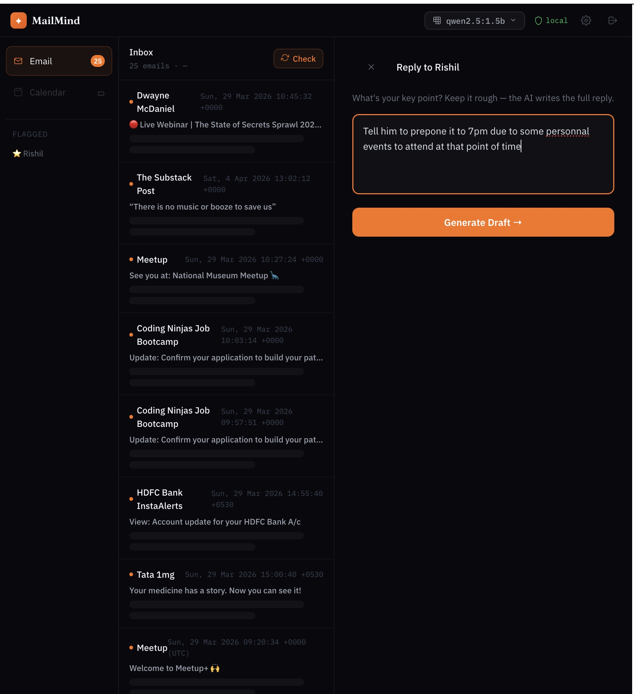
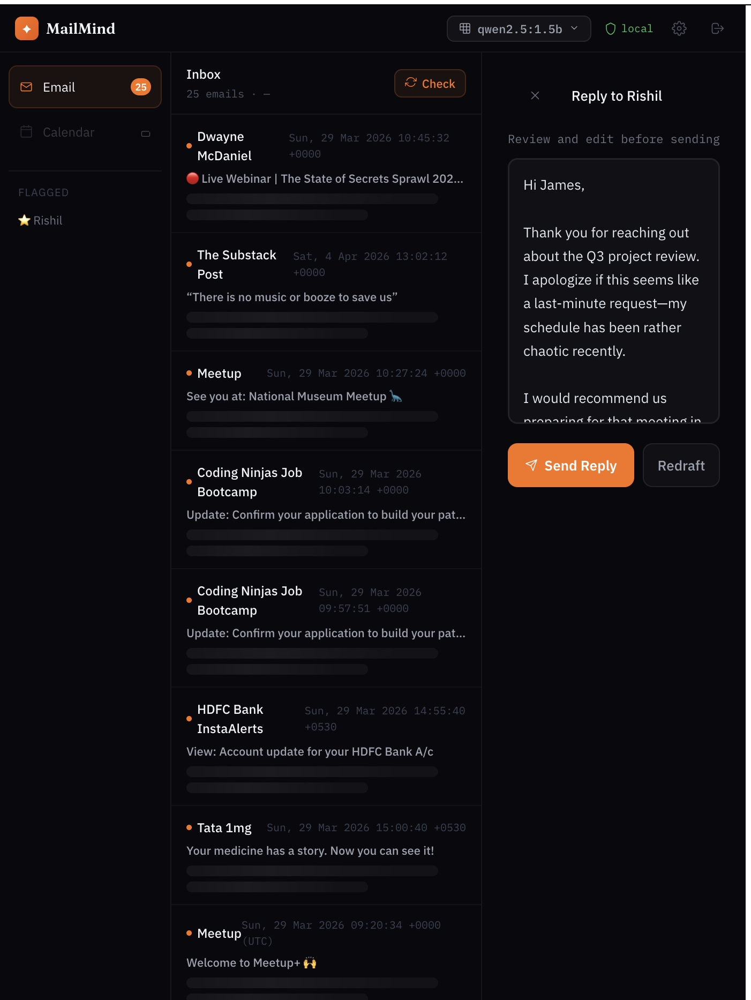

# MailMind ✦

> Privacy-first local AI email assistant. No cloud. No subscriptions. Zero data leaves your machine.

MailMind connects to your Gmail, summarises emails using a locally running LLM, and drafts replies — all on your laptop. Your emails never touch an external server.

---

## Why MailMind?

Gmail's AI summaries send your emails to Google's servers. For anyone handling sensitive data — lawyers, doctors, finance teams, or just people who value privacy — that's not acceptable.

MailMind runs 100% locally using [Ollama](https://ollama.com). Same AI productivity, zero cloud exposure.

---
## Motivtion
The main motivations for this project are privacy and cost-effectiveness. Unlike existing desktop AI tools or platforms like OpenClaw, which can act unpredictably by accessing and modifying random files without consent, this tool is designed for controlled execution. It operates exclusively within scoped tasks based on specific user instructions, ensuring it never affects unrelated data or files. To guarantee total privacy and eliminate subscription costs, the tool runs exclusively on Ollama, keeping all processing local. While other tools often require complex, perfectly phrased prompts to behave, this tool is built to do exactly what it is meant to do—nothing more.
## Features

- ✅ Gmail connection via IMAP App Password — no Google verification needed
- ✅ On-click AI summarisation using local Ollama models
- ✅ Reply drafting in your tone, signed with your name
- ✅ One-click sender blocking from the inbox
- ✅ Manual block list — block emails, domains, or keywords
- ✅ Persistent email store — survives page refresh and restarts
- ✅ Flagged thread memory using ChromaDB
- ✅ Works fully offline after setup

---

## Known Limitations

- ⚠ **Summary quality** depends on model size. `qwen2.5:1.5b` is fast but sometimes generic. Recommend `qwen2.5:3b` or larger for best results.
- ⚠ **Summarisation takes 5–15 seconds** per email on CPU — this is the nature of local inference, not a bug.
- ⚠ **Reply drafts** may occasionally use placeholder text with smaller models. Works best with 3B+ parameter models.
- ⚠ **Gmail only** for now — Outlook and other providers coming in v0.2.
- ⚠ **No background daemon yet** — you manually click Check to fetch new emails.
- ⚠ **No mobile app** — desktop browser only.
- - ⚠ **ChromaDB vector storage** is currently unreliable — flagged email embeddings 
  may not persist correctly depending on your system path configuration. 
  This is a known bug being fixed in v0.2. Flagging still works as a visual 
  bookmark in the meantime.

---

## Requirements

- Python 3.10+
- Node.js 18+
- [Ollama](https://ollama.com) installed and running
- Gmail account with:
  - 2-Step Verification enabled
  - IMAP enabled (Gmail Settings → Forwarding and POP/IMAP → Enable IMAP)
  - An App Password generated

---

## Quick Start

### 1. Clone the repo

```bash
git clone https://github.com/yourusername/mailmind.git
cd mailmind
```

### 2. Set up the backend

```bash
cd backend
python -m venv venv
source venv/bin/activate        # Windows: venv\Scripts\activate
pip install -r requirements.txt
```

Start the backend:

```bash
uvicorn main:app --reload --port 8000
```

### 3. Set up the frontend

```bash
cd frontend
npm install
npm run dev
```

Open [http://localhost:5173](http://localhost:5173) in your browser.

### 4. Set up Ollama

Install Ollama from [ollama.com](https://ollama.com), then pull a model:

```bash
# Recommended — good balance of speed and quality
ollama pull qwen2.5:3b

# Faster but lower quality
ollama pull qwen2.5:1.5b

# Best quality — slower on CPU
ollama pull deepseek-r1:7b

# Keep Ollama running
ollama serve
```

### 5. Connect Gmail

1. Go to [myaccount.google.com/apppasswords](https://myaccount.google.com/apppasswords)
2. Name it "MailMind" → Click **Create**
3. Copy the 16-character password (remove spaces)
4. Enter your Gmail address and app password in the MailMind setup screen

---

## Recommended Models

| Model | Size | Speed | Quality | Best For |
|-------|------|-------|---------|----------|
| `qwen2.5:1.5b` | 1GB | ⚡ Fast | Basic | Quick testing |
| `qwen2.5:3b` | 2GB | 🔶 Medium | Good | Daily use |
| `deepseek-r1:7b` | 4.7GB | 🐢 Slow | Best | Best quality |

Switch models anytime from the model dropdown in the top bar.

---

## Project Structure

```
mailmind/
├── backend/
│   ├── main.py              # FastAPI app — all API endpoints
│   └── requirements.txt
├── frontend/
│   └── src/
│       ├── App.jsx          # Router — setup vs dashboard
│       ├── pages/
│       │   ├── Setup.jsx    # 5-step onboarding wizard
│       │   └── Dashboard.jsx # Main inbox UI
└── README.md
```

---

## Data & Privacy

All data is stored locally on your machine:

| File | Location | Contents |
|------|----------|----------|
| Email store | `~/.mailmind/email_store.json` | Fetched emails + summaries |
| Credentials | `~/.mailmind/email_creds.json` | Gmail app password |
| Settings | `~/.mailmind/settings.json` | Your preferences |
| Block list | `~/.mailmind/blocklist.json` | Blocked senders |
| Embeddings | `~/.mailmind/chroma_db/` | Flagged thread vectors |

To wipe all data:

```bash
rm -rf ~/.mailmind
```

---

## Tech Stack

| Layer | Technology |
|-------|-----------|
| Backend | FastAPI (Python) |
| Frontend | React + Vite |
| AI | Ollama (local LLM) |
| Vector store | ChromaDB |
| Email | IMAP + SMTP |
| Fonts | IBM Plex Sans + Fraunces |

---

## Roadmap

- [ ] Background daemon with APScheduler (auto-fetch every N minutes)
- [ ] Outlook / Office 365 support
- [ ] Electron desktop app (full path folder picker, system tray)
- [ ] Calendar integration
- [ ] Streaming summarisation (see text appear in real time)
- [ ] Multi-account support

---
## Working Photos















## License

[BUSL 1.1](LICENSE) — free for personal use. Commercial use requires a licence. Converts to GPL in 2030.

---

## Contributing

This is an early-stage project. Issues and PRs welcome.
If you find a bug or have a feature request, open an issue.

---

Built by [Rishil Boddula](https://www.linkedin.com/in/rishil-b-b04b49223/) · MSc Advanced Computer Science